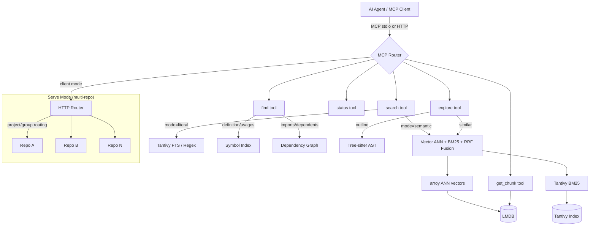

# codesearch

**Cross-repo semantic code search for AI agents — a Rust MCP server with vector + BM25 hybrid search, symbol navigation, and multi-repository orchestration.**

codesearch gives AI agents (OpenCode, Claude Code, Cursor, etc.) deep codebase understanding through 5 unified MCP tools. It runs entirely locally — no API calls, no cloud dependencies. Index once, search semantically across multiple repositories simultaneously.

## Why codesearch?

- **Multi-repo search**: Fan-out queries across repository groups
- **Hybrid retrieval**: Vector embeddings + BM25 full-text search fused with Reciprocal Rank Fusion
- **Symbol navigation**: Jump to definitions, find usages, trace imports and dependents
- **AST-aware chunking**: Tree-sitter parsing for 9 languages — chunks align to functions/classes, not arbitrary line ranges
- **Token-efficient**: Returns metadata by default; agents fetch full code only when needed via `get_chunk`
- **Zero config for single repos**: `codesearch index && codesearch mcp` — done

## Architecture



## Quick Start

### Install

Download pre-built binaries from [Releases](https://github.com/flupkede/codesearch/releases):

| Platform | Download |
|----------|----------|
| Windows x86_64 | `codesearch-windows-x86_64.zip` |
| Linux x86_64 | `codesearch-linux-x86_64.tar.gz` |
| macOS ARM64 | `codesearch-macos-arm64.tar.gz` |

Or build from source:

```bash
git clone https://github.com/flupkede/codesearch.git
cd codesearch
cargo build --release
```

### Index a repository

```bash
# Register and index a repo (adds to ~/.codesearch/repos.json)
codesearch index add /path/to/my-project --alias my-project

# Incremental update (only changed files)
codesearch index /path/to/my-project

# Full rebuild
codesearch index /path/to/my-project --force

# Remove a repo
codesearch index rm /path/to/my-project

# List registered repos
codesearch index list
```

First-time indexing takes 2–5 minutes. Subsequent runs are incremental (10–30s). Branch switches trigger automatic re-indexing.

## MCP Configuration

codesearch connects to AI agents via MCP. Two modes:

| Mode | How | Best for |
|------|-----|----------|
| **Local (stdio)** | `codesearch mcp` — single repo, auto-index + file watching | Working on one project |
| **Serve (HTTP)** | `codesearch serve` — multi-repo, TUI dashboard, lazy FSW | Multiple repos, cross-repo search |

### Local / Single Repo

The agent spawns `codesearch mcp` as a subprocess. It auto-detects the nearest index and starts a file watcher.

**OpenCode** — `~/.config/opencode/config.json`:

```json
{
  "mcp": {
    "codesearch": {
      "type": "local",
      "command": ["codesearch", "mcp"],
      "enabled": true
    }
  }
}
```

**Claude Code** — `~/.config/claude-code/config.json`:

```json
{
  "mcpServers": {
    "codesearch": {
      "command": "codesearch",
      "args": ["mcp"]
    }
  }
}
```

**Claude Desktop** — `claude_desktop_config.json`:

```json
{
  "mcpServers": {
    "codesearch": {
      "command": "codesearch",
      "args": ["mcp"]
    }
  }
}
```

### Serve / Multi-Repo

Start the server first, then connect your agent. The server manages all registered repos with a TUI dashboard, lazy filesystem watchers, and idle eviction.

```bash
# Start the server (default port 39725)
codesearch serve
```

**OpenCode** — connect via HTTP:

```json
{
  "mcp": {
    "codesearch": {
      "type": "remote",
      "url": "http://127.0.0.1:39725/mcp",
      "enabled": true
    }
  }
}
```

**Claude Code / Claude Desktop** — force serve connection via `--mode client`:

```json
{
  "mcpServers": {
    "codesearch": {
      "command": "codesearch",
      "args": ["mcp", "--mode", "client"]
    }
  }
}
```

> **Note:** In multi-repo mode, agents must specify `project` or `group` in tool calls. `status` always works without scope. `get_chunk` auto-routes when the chunk_id is unique across repos; if ambiguous, it returns candidates and requires `project`.

## MCP Tools Reference

### `search` — Code Search

| Parameter | Type | Description |
|-----------|------|-------------|
| `query` | string | Natural language, code snippet, regex, or exact term |
| `mode` | `"semantic"` \| `"literal"` | Search backend (default: semantic) |
| `filter_path` | string | Path prefix filter (semantic mode) |
| `file_glob` | string | Glob filter (literal mode), e.g. `"src/**/*.rs"` |
| `language` | string | Language filter (literal mode) |
| `regex` | bool | Treat query as regex (literal mode) |
| `phrase` | bool | Exact phrase match (literal mode) |
| `compact` | bool | Metadata only, no code (default: true) |
| `limit` | int | Max results (default: 10 semantic, 20 literal) |
| `project` | string | Target specific repo (multi-repo) |
| `group` | string | Search across repo group (multi-repo) |

**Semantic mode** combines vector similarity (fastembed) + BM25 lexical scoring + exact identifier boosting, fused with RRF. Best for conceptual queries and mixed natural-language + symbol searches.

**Literal mode** uses Tantivy FTS. Use `regex=true` for patterns with punctuation (`foo::bar`, `Vec<T>`). Use `phrase=true` for multi-word exact matches.

### `find` — Symbol Navigation

| Parameter | Type | Description |
|-----------|------|-------------|
| `symbol` | string | Symbol name or file path (for imports) |
| `kind` | `"definition"` \| `"usages"` \| `"imports"` \| `"dependents"` | Navigation type |
| `definition_kind` | string | Filter: Function, Class, Method, Struct, Trait, Enum, Interface |
| `project` / `group` | string | Multi-repo routing |

### `explore` — File Exploration

| Parameter | Type | Description |
|-----------|------|-------------|
| `target` | string | File path (outline) or chunk_id (similar) |
| `kind` | `"outline"` \| `"similar"` | Exploration type |
| `limit` | int | Max results for similar mode |
| `project` / `group` | string | Multi-repo routing |

**Outline** returns all top-level symbols in a file (kind, signature, line range).
**Similar** finds semantically related chunks to a given chunk_id.

### `get_chunk` — Read Code

| Parameter | Type | Description |
|-----------|------|-------------|
| `chunk_id` | int | Chunk ID from search/explore results |
| `context_lines` | int | Extra lines before/after (0-20, default: 0) |
| `project` | string | Disambiguate if chunk_id exists in multiple repos |

In multi-repo mode: auto-routes when chunk_id is unique; returns candidates list when ambiguous.

### `status` — Index Info

| Parameter | Type | Description |
|-----------|------|-------------|
| `kind` | `"index"` \| `"projects"` | What to query |
| `project` / `group` | string | Multi-repo routing |

## Serve Mode (Multi-Repo)

For working across multiple repositories simultaneously:

```bash
codesearch serve
```

This starts a background HTTP server with:
- **TUI dashboard** (ratatui) showing repo status, CPU usage, active sessions
- **Lazy filesystem watchers** — activated on first query per repo
- **Idle eviction** (30min) — unused repos are unloaded from memory
- **Session tracking** via MCP keep-alive

### Repository Registration

Repos are registered via `codesearch index add`:

```bash
# Register a repo (creates index + adds to ~/.codesearch/repos.json)
codesearch index add /path/to/my-project --alias my-project

# Remove a repo
codesearch index rm /path/to/my-project

# List registered repos
codesearch index list
```

Serve reads `~/.codesearch/repos.json` on startup and manages all registered repos.

### Groups

Groups let you search across related repositories:

```bash
codesearch groups add my-group repo1 repo2 repo3
codesearch groups list
```

Then in MCP tools: `group="my-group"` fans out the query to all repos in the group.

### MCP Connection Modes

The `codesearch mcp` command supports three modes:

| Mode | Behavior |
|------|----------|
| `auto` (default) | Connects to serve if running, otherwise local stdio |
| `client` | Always connects to serve, fails if not running |
| `local` | Always uses local DB (classic single-repo stdio) |

```bash
codesearch mcp --mode client  # force serve connection
```

The serve endpoint is available at `/mcp` (Streamable HTTP transport).

## CLI Reference

| Command | Description |
|---------|-------------|
| `codesearch index [PATH]` | Index a repo (incremental; `--force` for full rebuild) |
| `codesearch search <QUERY>` | CLI search (for testing) |
| `codesearch mcp` | Start MCP stdio server |
| `codesearch serve` | Start multi-repo HTTP server with TUI |
| `codesearch stats` | Show database statistics |
| `codesearch clear` | Delete index |
| `codesearch doctor` | Health check (model, index, config) |
| `codesearch setup` | Download embedding models |
| `codesearch cache stats\|clear` | Manage embedding cache |
| `codesearch groups list\|add\|remove` | Manage repository groups |

## Configuration

### Environment Variables

| Variable | Description |
|----------|-------------|
| `CODESEARCH_SERVE_PORT` | Serve mode port (default: 39725) |
| `CODESEARCH_MCP_MODE` | MCP mode: auto, client, local |
| `CODESEARCH_REPOS_CONFIG` | Path to repos.json |
| `CODESEARCH_REPO_IDLE_TIMEOUT_SECS` | Idle eviction timeout (default: 1800) |
| `CODESEARCH_CACHE_MAX_MEMORY` | Embedding cache MB (default: 500) |
| `CODESEARCH_BATCH_SIZE` | Embedding batch size |
| `RUST_LOG` | Log level (e.g. `codesearch=debug`) |

### `.codesearchignore`

Place in repo root. Gitignore syntax. Excludes paths from indexing:

```gitignore
# Vendored code
vendor/
node_modules/
# Generated files
*.generated.cs
**/migrations/**
```

### `repos.json`

Located at `~/.codesearch/repos.json`. Managed by `codesearch index add/rm`. Contains repo aliases → paths and group definitions. See [Serve Mode](#serve-mode-multi-repo).

## Supported Languages

Tree-sitter AST-aware chunking:

| Language | Extensions |
|----------|-----------|
| Rust | `.rs` |
| Python | `.py` |
| JavaScript | `.js`, `.jsx` |
| TypeScript | `.ts`, `.tsx` |
| C | `.c`, `.h` |
| C++ | `.cpp`, `.hpp` |
| C# | `.cs` |
| Go | `.go` |
| Java | `.java` |

All other text files use line-based chunking as fallback.

## Core Technology

| Component | Technology |
|-----------|-----------|
| Embedding | fastembed + ONNX Runtime (CPU) |
| Vector store | arroy (Approximate Nearest Neighbors) + LMDB |
| Full-text search | Tantivy (BM25, AND mode) |
| Chunking | Tree-sitter AST parsing |
| Incremental sync | SHA-256 content hashing |
| Caching | 3-layer: in-memory (Moka) → persistent disk → query cache |
| Schema | Versioned via `metadata.json` |

## Development

```bash
# Build
cargo build

# Run tests
cargo test

# Check + lint
cargo clippy --all-targets -- -D warnings

# Format
cargo fmt --all
```

## License

Apache-2.0

## Acknowledgements

This project is a fork of [demongrep](https://github.com/yxanul/demongrep) by [yxanul](https://github.com/yxanul). Huge thanks for building such a solid foundation.

Built with: [fastembed-rs](https://github.com/Anush008/fastembed-rs), [arroy](https://github.com/meilisearch/arroy), [tantivy](https://github.com/quickwit-oss/tantivy), [tree-sitter](https://tree-sitter.github.io/), [ratatui](https://github.com/ratatui/ratatui), [LMDB](http://www.lmdb.tech/).
