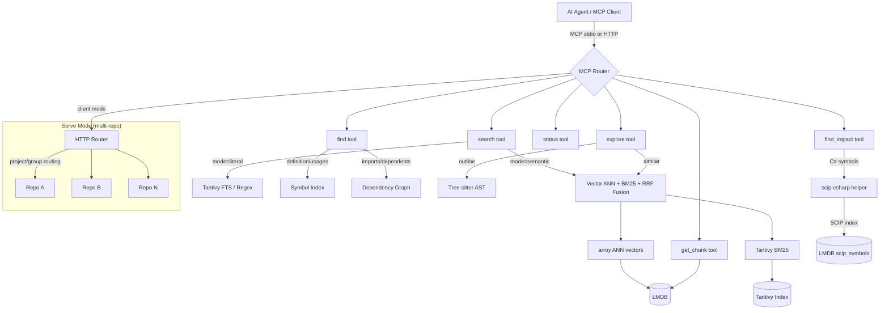

# codesearch

[](https://opensource.org/licenses/Apache-2.0)
[](https://www.rust-lang.org/)
[](https://modelcontextprotocol.io/)
[](https://github.com/flupkede/codesearch/releases)
[](https://github.com/flupkede/codesearch/stargazers)

**Multi-repo semantic code search for AI agents — a Rust MCP server with vector + BM25 hybrid retrieval, symbol navigation, and cross-repository orchestration. Fully local, fully offline, no GPU, no Docker.**

codesearch gives AI agents (OpenCode, Claude Code, Cursor, and any MCP client) deep codebase understanding through 5 unified MCP tools. Index once, search semantically across multiple repositories simultaneously.

## Why codesearch?

- **Multi-repo serve mode**: Fan-out queries across repository groups with cross-repo RRF ranking
- **Hybrid retrieval**: Vector embeddings + BM25 full-text search fused with Reciprocal Rank Fusion
- **Symbol navigation**: Jump to definitions, find usages, trace imports and dependents — in the same tool
- **AST-aware chunking**: Tree-sitter parsing for 16 languages — chunks align to functions/classes (and Markdown sections), not arbitrary line ranges
- **Token-efficient**: Returns metadata by default; agents fetch full code only when needed via `get_chunk`
- **Lightweight footprint**: Hundreds of MB on disk, runs on CPU only, no runtime model downloads (works behind enterprise proxies)
- **Zero config for single repos**: `codesearch index && codesearch mcp` — done

## How does this compare?

The MCP code-search ecosystem grew rapidly in late 2025 / early 2026 and many projects share the same baseline stack (Rust + tree-sitter + BM25 + embeddings + MCP). codesearch's deliberate focus is:

| Focus area | codesearch | Typical alternative |
|---|---|---|
| Repository scope | Multi-repo serve with cross-repo RRF | Usually single repo at a time |
| Footprint | ~hundreds of MB, CPU-only, no Docker | GB-scale, GPU, Docker, or cloud |
| Enterprise / offline | No runtime fetches; static binary | Often pulls models at first run |
| Symbol navigation | `find` (def/usages/imports/dependents) co-located with semantic search | Often a separate code-graph tool |
| Token cost per call | `compact=true` by default; chunks fetched on demand | Frequently dumps full snippets |

Other projects in the same niche may go deeper on call-graph traversal, polished standalone CLIs, or memory/knowledge-graph features. codesearch is intentionally narrower — it picks "lightweight, multi-repo, MCP-native, fully offline" and stays on that lane.

## Architecture



## Quick Start

### Install

Download pre-built binaries from [Releases](https://github.com/flupkede/codesearch/releases):

| Platform | Download |
|----------|----------|
| Windows x86_64 | `codesearch-windows-x86_64.zip` |
| Windows x86_64 + C# | `codesearch-windows-x86_64-with-csharp.zip` |
| Linux x86_64 | `codesearch-linux-x86_64.tar.gz` |
| Linux x86_64 + C# | `codesearch-linux-x86_64-with-csharp.tar.gz` |
| macOS ARM64 | `codesearch-macos-arm64.tar.gz` |
| macOS ARM64 + C# | `codesearch-macos-arm64-with-csharp.tar.gz` |

Or build from source:

```bash
git clone https://github.com/flupkede/codesearch.git
cd codesearch
cargo build --release
```

### Index a repository

```bash
# Register and index the current repo (adds to ~/.codesearch/repos.json)
codesearch index add

# Register and index a repo from outside the repo folder
codesearch index add /path/to/my-project

# Incremental update (only changed files)
codesearch index /path/to/my-project

# Full rebuild
codesearch index /path/to/my-project --force

# Remove a repo
codesearch index rm /path/to/my-project

# List registered repos
codesearch index list

# Remove stale entries (relocates moved repos first, then drops the rest)
codesearch index prune
```

`codesearch index add` is intended to be run from inside the repo you want to register.
If you're launching it from somewhere else, pass the repo path explicitly.

First-time indexing takes 2–5 minutes. Subsequent runs are incremental (10–30s). Branch switches trigger automatic re-indexing.

## MCP Configuration

codesearch connects to AI agents via MCP. Two modes:

| Mode | How | Best for |
|------|-----|----------|
| **Local (stdio)** | `codesearch mcp` — single repo, auto-index + file watching | Working on one project |
| **Serve (HTTP)** | `codesearch serve` — multi-repo, TUI dashboard, lazy FSW | Multiple repos, cross-repo search |

### Local / Single Repo

The agent spawns `codesearch mcp` as a subprocess. It auto-detects the nearest index and starts a file watcher.

**OpenCode** — `~/.config/opencode/config.json`:

```json
{
  "mcp": {
    "codesearch": {
      "type": "local",
      "command": ["codesearch", "mcp"],
      "enabled": true
    }
  }
}
```

**Claude Code** — `~/.config/claude-code/config.json`:

```json
{
  "mcpServers": {
    "codesearch": {
      "command": "codesearch",
      "args": ["mcp"]
    }
  }
}
```

**Claude Desktop** — `claude_desktop_config.json`:

```json
{
  "mcpServers": {
    "codesearch": {
      "command": "codesearch",
      "args": ["mcp"]
    }
  }
}
```

### Serve / Multi-Repo

Start the server first, then connect your agent. The server manages all registered repos with a TUI dashboard, lazy filesystem watchers, and idle eviction.

```bash
# Start the server (default port 39725)
codesearch serve
```

**OpenCode** — connect via HTTP:

```json
{
  "mcp": {
    "codesearch": {
      "type": "remote",
      "url": "http://127.0.0.1:39725/mcp",
      "enabled": true
    }
  }
}
```

**Claude Code / Claude Desktop** — force serve connection via `--mode client`:

```json
{
  "mcpServers": {
    "codesearch": {
      "command": "codesearch",
      "args": ["mcp", "--mode", "client"]
    }
  }
}
```

> **Note:** In multi-repo mode, agents must specify `project` or `group` in tool calls. `status` always works without scope. `get_chunk` auto-routes when the chunk_id is unique across repos; if ambiguous, it returns candidates and requires `project`.

## MCP Tools Reference

### `search` — Code Search

| Parameter | Type | Description |
|-----------|------|-------------|
| `query` | string | Natural language, code snippet, regex, or exact term |
| `mode` | `"semantic"` \| `"literal"` | Search backend (default: semantic) |
| `filter_path` | string | Path prefix filter (semantic mode) |
| `file_glob` | string | Glob filter (literal mode), e.g. `"src/**/*.rs"` |
| `language` | string | Language filter (literal mode) |
| `regex` | bool | Treat query as regex (literal mode) |
| `phrase` | bool | Exact phrase match (literal mode) |
| `compact` | bool | Metadata only, no code (default: true) |
| `limit` | int | Max results (default: 10 semantic, 20 literal) |
| `project` | string | Target specific repo (multi-repo) |
| `group` | string | Search across repo group (multi-repo) |

**Semantic mode** combines vector similarity (fastembed) + BM25 lexical scoring + exact identifier boosting, fused with RRF. Best for conceptual queries and mixed natural-language + symbol searches.

**Literal mode** uses Tantivy FTS. Use `regex=true` for patterns with punctuation (`foo::bar`, `Vec<T>`). Use `phrase=true` for multi-word exact matches.

### `find` — Symbol Navigation

| Parameter | Type | Description |
|-----------|------|-------------|
| `symbol` | string | Symbol name or file path (for imports) |
| `kind` | `"definition"` \| `"usages"` \| `"imports"` \| `"dependents"` | Navigation type |
| `definition_kind` | string | Filter: Function, Class, Method, Struct, Trait, Enum, Interface |
| `project` / `group` | string | Multi-repo routing |

### `explore` — File Exploration

| Parameter | Type | Description |
|-----------|------|-------------|
| `target` | string | File path (outline) or chunk_id (similar) |
| `kind` | `"outline"` \| `"similar"` | Exploration type |
| `limit` | int | Max results for similar mode |
| `project` / `group` | string | Multi-repo routing |

**Outline** returns all top-level symbols in a file (kind, signature, line range).
**Similar** finds semantically related chunks to a given chunk_id.

### `get_chunk` — Read Code

| Parameter | Type | Description |
|-----------|------|-------------|
| `chunk_id` | int | Chunk ID from search/explore results |
| `context_lines` | int | Extra lines before/after (0-20, default: 0) |
| `project` | string | Disambiguate if chunk_id exists in multiple repos |

In multi-repo mode: auto-routes when chunk_id is unique; returns candidates list when ambiguous.

### `find_impact` — Symbol Reference Impact

Find all call-sites and references to a symbol with file/line precision, powered by per-language semantic analysis. Currently supports **C#** (via the bundled `scip-csharp` helper).

| Parameter | Type | Description |
|-----------|------|-------------|
| `symbol_name` | string | Symbol name (e.g. `"FieldDefinition.Validate"`) |
| `file` | string | File path for position-based lookup |
| `line` | int | Line number for position-based lookup |
| `language` | string | Language hint (auto-detected from file extension) |
| `project` / `group` | string | Multi-repo routing |

Returns a list of references with `file`, `start_line`, `end_line`, and `kind` (e.g. `"call"`, `"definition"`). Exposes `index_age_seconds` so agents can reason about staleness.

> **Note:** Requires the `-with-csharp` release variant or a separately installed `scip-csharp` helper. See [C# Semantic Search](#c-semantic-search).

### `status` — Index Info

| Parameter | Type | Description |
|-----------|------|-------------|
| `kind` | `"index"` \| `"projects"` | What to query |
| `project` / `group` | string | Multi-repo routing |

## Serve Mode (Multi-Repo)

For working across multiple repositories simultaneously:

```bash
codesearch serve
```

This starts a background HTTP server with:
- **TUI dashboard** (ratatui) showing repo status, CPU usage, active sessions
- **Lazy filesystem watchers** — activated on first query per repo
- **Idle eviction** (30min) — unused repos are unloaded from memory
- **Session tracking** via MCP keep-alive

### TUI Keyboard Shortcuts

| Key | Action |
|-----|--------|
| `↑` / `↓` | Navigate repo list |
| `i` | Show info overlay (chunks, files, model, DB size) |
| `d` | Run doctor diagnostics on selected repo |
| `f` | Force reindex selected repo |
| `r` | Remove selected repo (with confirmation dialog) |
| `s` | Reload repos config from disk |
| `q` | Quit serve |

### Repository Registration

Repos are registered via `codesearch index add`:

```bash
# Register a repo (creates index + adds to ~/.codesearch/repos.json)
codesearch index add /path/to/my-project

# Remove a repo
codesearch index rm /path/to/my-project

# List registered repos
codesearch index list

# Clean up stale entries (relocates moved repos, drops the rest)
codesearch index prune
```

The repository **alias** (the key in `repos.json`, used for groups and the MCP
`project` argument) is always derived automatically from the directory name —
there is no `--alias` flag.

Serve reads `~/.codesearch/repos.json` on startup and manages all registered repos.

#### Moved or renamed repositories

If you rename or move a registered folder, serve does **not** crash. On startup
it tries to **relocate** each missing repo automatically: it captures every
repo's git remote (`remote.origin.url`) at registration, and on a missing path
it scans nearby folders (bounded depth, override with
`CODESEARCH_RELOCATE_MAX_DEPTH`, default `3`) for a git checkout with the same
remote. A single unambiguous match is rewritten into `repos.json`; otherwise the
entry is logged and skipped (never indexed against a dead path). Run
`codesearch index prune` to relocate what can be relocated and drop the rest.

A hand-edited `repos.json` is also tolerated: empty entries, orphaned metadata,
and group references to unknown repos are cleaned up on load rather than
crashing.

### Groups

Groups let you search across related repositories:

```bash
codesearch groups add my-group --aliases repo1 repo2 repo3
codesearch groups list
```

Then in MCP tools: `group="my-group"` fans out the query to all repos in the group.

#### The `all` group

The name `all` is a **reserved virtual group** that always resolves to *every* registered repository — no setup required:

```
group="all"   # fans out to all repos, equivalent to listing every alias
```

- It is **not stored** in `repos.json` and always reflects the current set of registered repos (register or remove a repo and `all` updates automatically).
- It appears in `codesearch groups list` (marked `virtual`) and in the `scope_required` error's `available_groups`, so agents discover it without extra setup.
- It is **not the default** — when no `project`/`group` is specified in multi-repo mode, codesearch still returns `scope_required` (safe-by-default). Use `group="all"` explicitly when you want to search everywhere.
- `codesearch groups add all` and `codesearch groups remove all` are **rejected** — the name is reserved.

### Git Worktree Auto-Index

When using `git worktree add` to create parallel working directories, codesearch can auto-register new worktrees via a `post-checkout` git hook.

**Setup** (run inside any repo you want worktree auto-indexing for):

```bash
codesearch hook install
```

This writes a `post-checkout` hook to `.git/hooks/` that POSTs the worktree path to the running serve instance whenever a new worktree is checked out. The hook reads the serve URL from `~/.codesearch/serve_url` (automatically managed by `codesearch serve`).

**How it works:**
1. `codesearch serve` writes its URL to `~/.codesearch/serve_url` on startup (deletes on shutdown)
2. The `post-checkout` hook reads that file and POSTs the working directory to `POST /repos`
3. Serve registers the worktree path and begins indexing (deduped — won't re-register existing paths)

### MCP Connection Modes

The `codesearch mcp` command supports three modes:

| Mode | Behavior |
|------|----------|
| `auto` (default) | Connects to serve if running, otherwise local stdio |
| `client` | Always connects to serve, fails if not running |
| `local` | Always uses local DB (classic single-repo stdio) |

```bash
codesearch mcp --mode client  # force serve connection
```

The serve endpoint is available at `/mcp` (Streamable HTTP transport).

## CLI Reference

| Command | Description |
|---------|-------------|
| `codesearch index [PATH]` | Index a repo (incremental; `--force` for full rebuild) |
| `codesearch search <QUERY>` | CLI search (for testing) |
| `codesearch mcp` | Start MCP stdio server |
| `codesearch serve` | Start multi-repo HTTP server with TUI |
| `codesearch stats` | Show database statistics |
| `codesearch clear` | Delete index |
| `codesearch doctor` | Health check (model, index, config) |
| `codesearch setup` | Download embedding models |
| `codesearch cache stats\|clear` | Manage embedding cache |
| `codesearch groups list\|add\|remove` | Manage repository groups |
| `codesearch hook install` | Install git post-checkout hook for worktree auto-indexing |

## Configuration

### Environment Variables

| Variable | Description |
|----------|-------------|
| `CODESEARCH_SERVE_PORT` | Serve mode port (default: 39725) |
| `CODESEARCH_SERVE_API_KEY` | API key for management endpoints + all endpoints when serve binds to a non-localhost address (unset = no auth) |
| `CODESEARCH_ALLOWED_ROOTS` | Semicolon-separated allowed roots for repo registration (unset = all allowed) |
| `CODESEARCH_MCP_MODE` | MCP mode: auto, client, local |
| `CODESEARCH_REPOS_CONFIG` | Path to repos.json |
| `CODESEARCH_REPO_IDLE_TIMEOUT_SECS` | Idle eviction timeout (default: 1800) |
| `CODESEARCH_CACHE_MAX_MEMORY` | Embedding cache MB (default: 500) |
| `CODESEARCH_BATCH_SIZE` | Embedding batch size |
| `CODESEARCH_SCIP_CSHARP` | Override path to `scip-csharp` helper |
| `RUST_LOG` | Log level (e.g. `codesearch=debug`) |

### Security

When `codesearch serve` is exposed beyond a single trusted user (e.g. shared dev machines, a network bind), two environment variables harden access:

- **`CODESEARCH_SERVE_API_KEY`** — gates access depending on how serve is bound:
  - **Non-localhost bind** (`--host 0.0.0.0`, a LAN IP, etc.) — **ALL endpoints** require the key (health, status, MCP search, and management). Setting this variable is *required* when binding to a non-localhost address; serve refuses to start without it.
  - **Localhost bind** (default) — only **management endpoints** (`POST /repos`, `DELETE /repos/:alias`, `POST /repos/:alias/reindex`, `POST /reload`) require the key. Health, status, and MCP search remain open.
  - Send the key on every request via `Authorization: Bearer <key>` or `X-API-Key: <key>`.
  - **Client side:** `codesearch index add/rm/reindex` delegate to a running serve, so the CLI must send the same key. Set `CODESEARCH_SERVE_API_KEY` in the client's environment (same value as the server) and the CLI attaches it automatically. Without it, delegation returns `401` and falls back to local indexing — which risks LMDB file-lock conflicts if serve is still running.
- **`CODESEARCH_ALLOWED_ROOTS`** — semicolon-separated list of filesystem roots. Repo registration is rejected for paths outside these roots. Prevents indexing arbitrary directories.

Both are backward compatible: unset means no restriction (on a localhost bind).

### `.codesearchignore`

Place in repo root. Gitignore syntax. Excludes paths from indexing:

```gitignore
# Vendored code
vendor/
node_modules/
# Generated files
*.generated.cs
**/migrations/**
```

A **global** `.codesearchignore` can be placed at `~/.codesearch/.codesearchignore`. It applies to all repos with the lowest priority (repo-local `.codesearchignore`, `.gitignore`, and `.git/info/exclude` all override it). This is useful for patterns you want everywhere without modifying each repo.

### `repos.json`

Located at `~/.codesearch/repos.json`. Managed by `codesearch index add/rm`. Contains repo aliases → paths and group definitions. See [Serve Mode](#serve-mode-multi-repo).

## C# Semantic Search

All C#-specific setup, operation, installation, and testing lives in [README_CSharp.md](README_CSharp.md).

If you do not work with C# repos, you can skip it entirely.

## Supported Languages

Tree-sitter AST-aware chunking:

| Language | Extensions |
|----------|-----------|
| Rust | `.rs` |
| Python | `.py`, `.pyw`, `.pyi` |
| JavaScript | `.js`, `.mjs`, `.cjs` |
| TypeScript | `.ts`, `.tsx`, `.jsx`, `.mts`, `.cts` |
| C | `.c`, `.h` |
| C++ | `.cpp`, `.cc`, `.cxx`, `.hpp`, `.hxx` |
| C# | `.cs` |
| Go | `.go` |
| Java | `.java` |
| Dart | `.dart` |
| Shell | `.sh`, `.bash`, `.zsh` |
| Ruby | `.rb`, `.rake` |
| PHP | `.php` |
| YAML | `.yaml`, `.yml` |
| JSON | `.json` |
| Markdown | `.md`, `.markdown`, `.txt` |
| Jupyter | `.ipynb` |

Markdown uses the tree-sitter-md **block** grammar — chunks align to sections,
headings, and code fences. Jupyter notebooks are parsed as JSON; code and
markdown cells are extracted, tagged with `[code]` or `[markdown]`, and
adjacent same-type cells under 50 lines are merged into single chunks.
All other text files use line-based chunking as fallback.

## Core Technology

| Component | Technology |
|-----------|-----------|
| Embedding | fastembed + ONNX Runtime (CPU) |
| Vector store | arroy (Approximate Nearest Neighbors) + LMDB |
| Full-text search | Tantivy (BM25, AND mode) |
| Chunking | Tree-sitter AST parsing |
| Incremental sync | SHA-256 content hashing |
| Caching | 3-layer: in-memory (Moka) → persistent disk → query cache |
| Schema | Versioned via `metadata.json` |

## Development

```bash
# Build
cargo build

# Run tests
cargo test

# Check + lint
cargo clippy --all-targets -- -D warnings

# Format
cargo fmt --all
```

## License

Apache-2.0

## Acknowledgements

This project is a fork of [demongrep](https://github.com/yxanul/demongrep) by [yxanul](https://github.com/yxanul). Huge thanks for building such a solid foundation.

Built with: [fastembed-rs](https://github.com/Anush008/fastembed-rs), [arroy](https://github.com/meilisearch/arroy), [tantivy](https://github.com/quickwit-oss/tantivy), [tree-sitter](https://tree-sitter.github.io/), [ratatui](https://github.com/ratatui/ratatui), [LMDB](http://www.lmdb.tech/).
